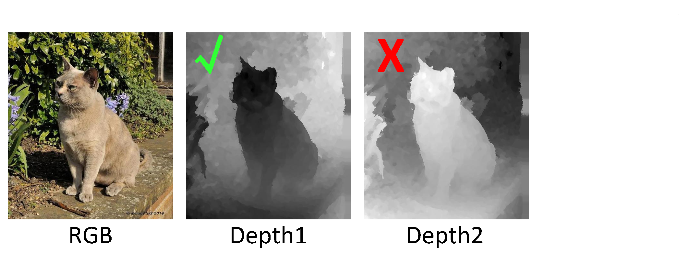

# JL-DCF-pytorch

Pytorch implementation for JL-DCF: Joint Learning and Densely-Cooperative Fusion Framework for RGB-D Salient Object Detection (CVPR2020) [[PDF](https://openaccess.thecvf.com/content_CVPR_2020/papers/Fu_JL-DCF_Joint_Learning_and_Densely-Cooperative_Fusion_Framework_for_RGB-D_Salient_CVPR_2020_paper.pdf)][[中文版](http://dpfan.net/wp-content/uploads/cvpr2020JLDCF_CameraReady_Chinese_final.pdf)], Siamese Network for RGB-D Salient Object Detection and Beyond (TPAMI2021) [[PDF](https://arxiv.org/pdf/2008.12134.pdf)]

# Requirements
* Python 3.6 <br>
* Pytorch 1.5.0 <br>
* Torchvision 0.6.1 <br>
* Cuda 10.0

# Usage
This is the Pytorch implementation of JL-DCF. It has been trained and tested on Windows (Win10 + Cuda 10 + Python 3.6 + Pytorch 1.5),
and it should also work on Linux but we didn't try. 

## To Train 
* Download the pre-trained ImageNet [backbone](#pre\-trained-imagenet-model-for-training) (resnet101/resnet50, densenet161, vgg16 and vgg_conv1, whereas the latter already exists in the folder), and put it in the 'pretrained' folder.
* Download the [training dataset](#dataset) and modify the 'train_root' and 'train_list' in the `main.py`.


* Start to train with
```sh
python main.py --mode=train --arch=resnet --network=resnet101 --train_root=xx/dataset/RGBDcollection --train_list=xx/dataset/RGBDcollection/train.lst 
```

**The converged loss value should be in the range of 5000~8000.**

## To Test 
* Download the [testing dataset](#dataset) and have it in the 'dataset/test/' folder. 
* Download the [already-trained JL-DCF pytorch model](#trained-model-for-testing) and modify the 'model' to its saving path in the `main.py`.
* Start to test with
```sh
python main.py --mode=test --arch=resnet --network=resnet101 --model=xx/JLDCF_resnet101.pth --sal_mode=LFSD  --test_folder=test/LFSD  
```

**Be careful that `model` and `network` should match.**

## Learning curve
The training log is saved in the 'log' folder. If you want to see the learning curve, you can get it by using: ` tensorboard --logdir your-log-path`

# Pre-trained ImageNet model for training
[densenet161](https://download.pytorch.org/models/densenet161-8d451a50.pth)<br>
[resnet101](https://download.pytorch.org/models/resnet101-5d3b4d8f.pth)<br>
[resnet50](https://download.pytorch.org/models/resnet50-19c8e357.pth)<br>
[vgg16](https://download.pytorch.org/models/vgg16-397923af.pth)<br>
[vgg_conv1](https://pan.baidu.com/s/1CJyNALzPIAiHrDSMcRO2yA), password: rllb<br>

# Trained model for testing
**Resnet101:**

Baidu Pan: [resnet101](https://pan.baidu.com/s/1KoxUvnnM5zJoFPEkrv7b1Q), password: jdpb<br>
Google Drive: https://drive.google.com/open?id=12u37yz-031unDPJoKaZ0goK8BtPP-6Cj<br>

**Resnet50:**

Baidu Pan: [resnet50](https://pan.baidu.com/s/1OwsKmiPZ73iIJU3IExGnIA), password: ve9z

**vgg16:**

Baidu Pan: [vgg16](https://pan.baidu.com/s/1aEu9Lzug7c7dEi1fyl9SCA), password: 4yv6

**Densenet161:**

Baidu Pan: [densenet161](https://pan.baidu.com/s/1yOHzC7KwQIVN2ySqmrcxAQ), password: qza4

# JL-DCF-pytorch saliency maps
**Resnet101 (NJU2K, NLPR, STERE, RGBD135, LFSD, SIP, DUT-RGBD):**

Baidu Pan: [resnet101](https://pan.baidu.com/s/1LRJDJLYl8RD0TsHksRJ2kg), password: v144<br>
Google Drive: https://drive.google.com/file/d/1GoqDlLrN_INNldsbOEAxyyu1QB_urHr0/view?usp=sharing<br>

**Resnet50 (NJU2K, NLPR, STERE, RGBD135, LFSD, SIP, DUT-RGBD):**

Baidu Pan: [resnet50](https://pan.baidu.com/s/1iB77wSXU6FYSRZiR-4ysVg), password: zen9

**vgg16 (NJU2K, NLPR, STERE, RGBD135, LFSD, SIP, DUT-RGBD):**

Baidu Pan: [vgg16](https://pan.baidu.com/s/1F_w1HRA50_OQwaGYWcZBdw), password: cuui

**Densenet161 (NJU2K, NLPR, STERE, RGBD135, LFSD, SIP, DUT-RGBD):**

Baidu Pan: [densenet161](https://pan.baidu.com/s/1onL9eYXxcROXwvPlYeIKCA), password: ovuc

## Important Tips!
Note that our JL-DCF model was trained on depth maps which satisfy the rule that closer objects present lower depth values (are "black"), 
while further objects have higher depth values (are "white"). Although these depth maps are normalized into the range [0, 1], such a rule is enforced 
to meet physical common sense. We observed that the model performance would somewhat degrade when using reversed maps during testing. <strong>So be aware of this issue when testing the models.</strong>
Anyway, the training and testing settings should always be kept consistent.


# Dataset
Baidu Pan:<br>
[Training dataset (with horizontal flip)](https://pan.baidu.com/s/1vrVcRFTMRO5v-A6Q2Y3-Nw), password:  i4mi<br>
[Testing datadet](https://pan.baidu.com/s/13P-f3WbA76NVtRePcFbVFw), password:   1ju8<br>
Google Drive:<br>
[Training dataset (with horizontal flip)](https://drive.google.com/open?id=12ais7wZhTjaFO4BHJyYyNuzzM312EWCT)<br>
[Testing datadet](https://drive.google.com/open?id=18ALe_HBuNjVTB_US808d8ZKfpd_mwLy5)<br>

# Performance
Below is the performance of JL-DCF-pyotrch (Pytorch implementation). Generally, the performance of Pytorch implementation is comparable to, and even slightly better than the previous [Caffe implementation](https://github.com/kerenfu/JLDCF/) reported in the paper. This is probably due to the differences between deep learning platforms. Also, due to the randomness in the training process, the obtained results will fluctuate slightly.

| Datasets | Metrics   | Pytorch ResNet101 | Pytorch ResNet50 | Pytorch VGG16 | Pytorch DenseNet161 |
| -------- | --------- | ----------------- | ---------------- | ------------- |---------------------|
| NJU2K    | S-measure | 0.917             | 0.913            | 0.910         | 0.917               |
|          | maxF      | 0.919             | 0.915            | 0.912         | 0.917               |
|          | maxE      | 0.950             | 0.951            | 0.949         | 0.952               |
|          | MAE       | 0.037             | 0.039            | 0.038         | 0.037               |
| NLPR     | S-measure | 0.931             | 0.931            | 0.926         | 0.934               |
|          | maxF      | 0.920             | 0.918            | 0.915         | 0.924               |
|          | maxE      | 0.964             | 0.965            | 0.963         | 0.967               |
|          | MAE       | 0.022             | 0.022            | 0.024         | 0.020               |
| STERE    | S-measure | 0.906             | 0.900            | 0.900         | 0.909               |
|          | maxF      | 0.903             | 0.895            | 0.898         | 0.905               |
|          | maxE      | 0.946             | 0.942            | 0.942         | 0.947               |
|          | MAE       | 0.040             | 0.044            | 0.042         | 0.039               |
| RGBD135  | S-measure | 0.934             | 0.928            | 0.925         | 0.934               |
|          | maxF      | 0.928             | 0.918            | 0.918         | 0.926               |
|          | maxE      | 0.967             | 0.957            | 0.960         | 0.964               |
|          | MAE       | 0.020             | 0.021            | 0.021         | 0.020               |
| LFSD     | S-measure | 0.862             | 0.850            | 0.833         | 0.863               |
|          | maxF      | 0.861             | 0.855            | 0.839         | 0.868               |
|          | maxE      | 0.894             | 0.887            | 0.879         | 0.900               |
|          | MAE       | 0.074             | 0.081            | 0.084         | 0.073               |
| SIP      | S-measure | 0.879             | 0.885            | 0.887         | 0.894               |
|          | maxF      | 0.889             | 0.894            | 0.896         | 0.903               |
|          | maxE      | 0.925             | 0.931            | 0.931         | 0.934               |
|          | MAE       | 0.050             | 0.049            | 0.047         | 0.044               |
| DUT-RGBD | S-measure | 0.905             | 0.894            | 0.881         | 0.914               |
|          | maxF      | 0.903             | 0.892            | 0.878         | 0.916               |
|          | maxE      | 0.937             | 0.928            | 0.921         | 0.945               |
|          | MAE       | 0.042             | 0.048            | 0.054         | 0.040               |

# Citation
Please cite our paper if you find the work useful: 

	@inproceedings{Fu2020JLDCF,
  	title={JL-DCF: Joint Learning and Densely-Cooperative Fusion Framework for RGB-D Salient Object Detection},
  	author={Fu, Keren and Fan, Deng-Ping and Ji, Ge-Peng and Zhao, Qijun},
  	booktitle={IEEE Conference on Computer Vision and Pattern Recognition (CVPR)},
  	pages={3052--3062},
  	year={2020}
	}
        
	@article{Fu2021siamese,
  	title={Siamese Network for RGB-D Salient Object Detection and Beyond},
  	author={Fu, Keren and Fan, Deng-Ping and Ji, Ge-Peng and Zhao, Qijun and Shen, Jianbing and Zhu, Ce},
  	journal={IEEE Transactions on Pattern Analysis and Machine Intelligence (TPAMI)},
  	year={2021}
	}
# Benchmark RGB-D SOD
The complete RGB-D SOD benchmark can be found in this page  
http://dpfan.net/d3netbenchmark/
